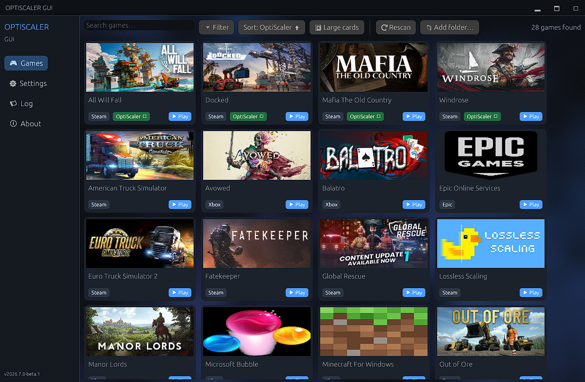
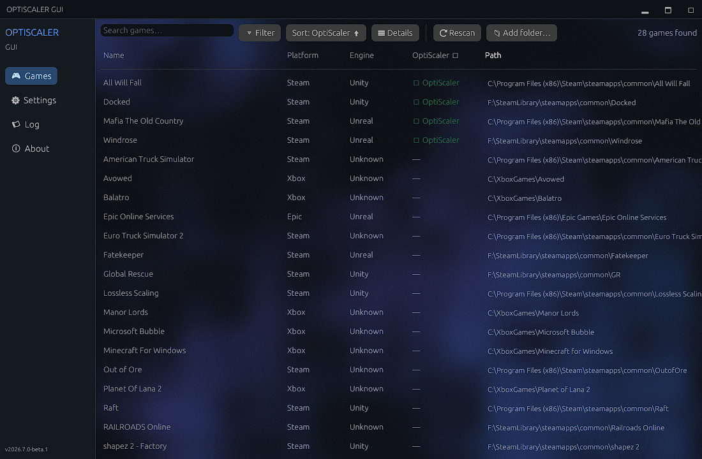

# OptiScaler GUI

[](https://github.com/King4s/OptiScaler-GUI/releases/latest)
[](https://github.com/King4s/OptiScaler-GUI/actions/workflows/ci.yml)
[](LICENSE)
[](#)

**An unofficial Windows installer and manager for [OptiScaler](https://github.com/optiscaler/OptiScaler).**

All upscaling technology — FSR, XeSS, DLSS integration, frame generation, the in-game overlay — is the work of the [OptiScaler team](https://github.com/optiscaler/OptiScaler). This project does one thing: it makes installing their mod easy. It detects your games, downloads the latest official OptiScaler release, and copies the right files into the right place — no manual extraction, renaming, or INI editing.

> **This is a community project, not affiliated with or endorsed by the OptiScaler developers.**
> Support and bug reports for this tool go to [this repository's issues](https://github.com/King4s/OptiScaler-GUI/issues) only — **please don't ask the OptiScaler team about this tool.** For questions about OptiScaler itself, use the [official repository](https://github.com/optiscaler/OptiScaler).



## Features

- **One-click install, update, and uninstall** of official OptiScaler releases
- **Game auto-detection** for Steam, Epic Games, GOG Galaxy, Xbox Game Pass, and Heroic Launcher — plus manual folder selection for everything else
- **Launch games directly** — with or without the OptiScaler proxy (Steam games via the Steam client, Game Pass via the bundled launch helper)
- **Engine-aware installation** — detects Unreal Engine games and installs to `Engine/Binaries/Win64`, warns about known anti-cheat risks
- **Settings editor** for `OptiScaler.ini` with per-key reset, restore-defaults, and GPU-based auto settings (runtime tuning is still done in OptiScaler's own Insert-key overlay)
- **Safe updates** — SHA256 verification of downloads, config backup, and rollback on failed installs
- **Explorer-style library** — large/small cards, list and details views, full sorting and filtering, artwork for every store
- **GPU-rendered UI** (egui/wgpu) with selectable animated backgrounds — and zero idle cost when disabled
- **Portable** — one ~7.5 MB native exe, nothing to install, no runtime dependencies
- **Languages:** English, Danish, Polish



## Getting started

1. Download `OptiScaler-GUI.exe` from the [latest release](https://github.com/King4s/OptiScaler-GUI/releases/latest)
2. Run it — no installation or extraction needed
3. Scan for games (or browse to a game folder manually), select a game, click **Install**
4. Launch the game and press **Insert** to configure upscaling in OptiScaler's overlay

Requires Windows 10/11. The GUI downloads OptiScaler exclusively from the official GitHub releases and works offline otherwise — no data collection.

## OptiScaler compatibility

The current release supports OptiScaler **v0.7.0 through v0.9.3** and always downloads the latest official release. When a new OptiScaler version changes the payload layout, a compatibility update is released — see the [releases](https://github.com/King4s/OptiScaler-GUI/releases) for history.

## Project status

| Track | Where | Status |
|---|---|---|
| Rust app (CalVer `2026.x`) | `rust/` | 🚀 **Beta — the recommended download.** Native single-exe app; reads and manages installs made by the old Python version. See [`rust/PARITY.md`](rust/PARITY.md) for the verified feature-parity status. |
| Python app (v0.x) | `src/` | ⚠️ **Legacy — phased out.** Final release is [v0.5.2](https://github.com/King4s/OptiScaler-GUI/releases/tag/v0.5.2); security/compatibility fixes only. Your existing installs carry over to the Rust app automatically. |

## Running from source

```bash
git clone https://github.com/King4s/OptiScaler-GUI.git
cd OptiScaler-GUI/rust
cargo run --release
```

Run the tests with `cargo test --workspace`. The legacy Python app still runs from `src/` (`pip install -r requirements.txt && python src/main.py`); its implementation details are covered in the [technical overview](docs/TECHNICAL_OVERVIEW.md).

## Reporting issues

- [Bug report](https://github.com/King4s/OptiScaler-GUI/issues/new?template=bug_report.md)
- [Game compatibility issue](https://github.com/King4s/OptiScaler-GUI/issues/new?template=game_compatibility.md)
- [Feature request](https://github.com/King4s/OptiScaler-GUI/issues/new?template=feature_request.md)

## Credits

- The [**OptiScaler team**](https://github.com/optiscaler/OptiScaler) — for the upscaling technology this project exists to serve. If you find OptiScaler useful, consider [supporting them](https://github.com/sponsors/cdozdil).
- OptiScaler bundles further excellent work: [fakenvapi](https://github.com/optiscaler/fakenvapi), Nukem's [dlssg-to-fsr3](https://github.com/Nukem9/dlssg-to-fsr3), AMD FidelityFX SDK, and Intel XeSS SDK.

## License

MIT — see [LICENSE](LICENSE). OptiScaler and its bundled components are licensed by their respective authors.
