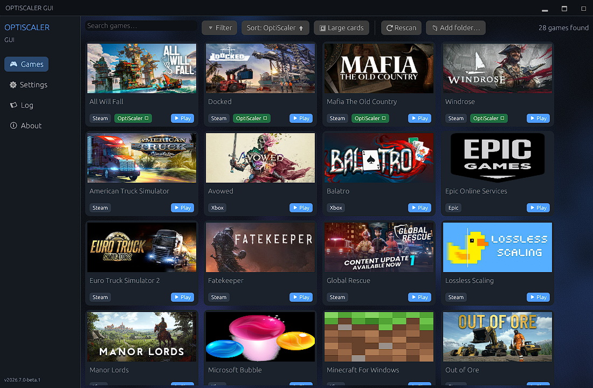
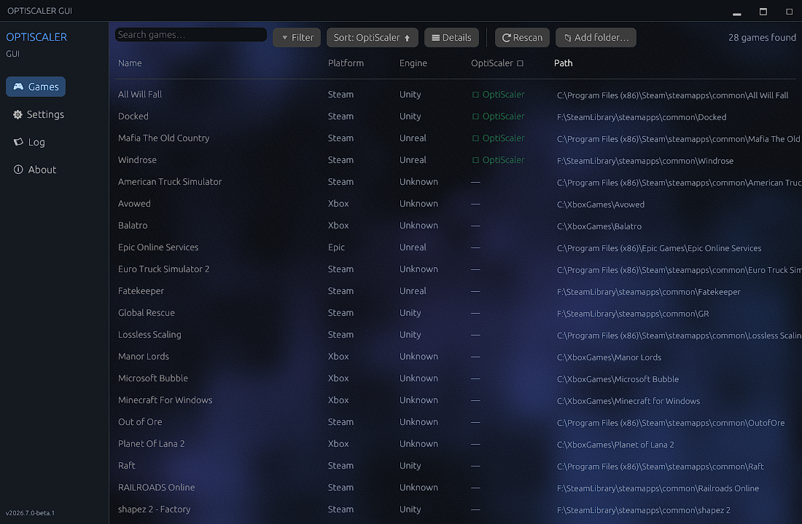

# OptiScaler GUI

[](https://github.com/King4s/OptiScaler-GUI/releases/latest)
[](https://github.com/King4s/OptiScaler-GUI/actions/workflows/ci.yml)
[](LICENSE)
[](#)

**An unofficial Windows installer and manager for [OptiScaler](https://github.com/optiscaler/OptiScaler).**

All upscaling technology — FSR, XeSS, DLSS integration, frame generation, the in-game overlay — is the work of the [OptiScaler team](https://github.com/optiscaler/OptiScaler). This project does one thing: it makes installing their mod easy. It detects your games, downloads the latest official OptiScaler release, and copies the right files into the right place — no manual extraction, renaming, or INI editing.

> **This is a community project, not affiliated with or endorsed by the OptiScaler developers.**
> Support and bug reports for this tool go to [this repository's issues](https://github.com/King4s/OptiScaler-GUI/issues) only — **please don't ask the OptiScaler team about this tool.** For questions about OptiScaler itself, use the [official repository](https://github.com/optiscaler/OptiScaler).



## Features

2026.9.0 brings broader game discovery, configurable library folders and per-install artwork controls.

- **One-click install, update, and uninstall** of official OptiScaler releases
- **Game discovery** for Steam, Epic Games, GOG Galaxy, Xbox Game Pass, Heroic Launcher, Amazon Games, Ubisoft Connect, EA app and Battle.net; configurable library folders can be enabled, removed and rescanned
- **Launch games directly** — with or without the OptiScaler proxy (Steam games via the Steam client, Game Pass via the bundled launch helper)
- **Reviewed install targets** — resolves the selected game executable to a target folder, shows both paths before install, and requires explicit selection when the layout is ambiguous; includes the documented Satisfactory target exception
- **Settings editor** for `OptiScaler.ini` with per-key reset and change preview (runtime tuning is still done in OptiScaler's own Insert-key overlay)
- **Transactional install management** — SHA256 verification, v2 ownership manifest, preservation of pre-existing files, and rollback/recovery snapshots
- **Local guidance and report preview** — inspect detected GPU facts and source-linked advice, then review and explicitly save a limited JSON report with your test result
- **Explorer-style library** — large/small cards, list and details views, sorting and filtering, aspect-preserving covers, local artwork selection and optional SteamGridDB matching
- **GPU-rendered UI** (egui/wgpu) with selectable animated backgrounds — and zero idle cost when disabled
- **Portable** — a native executable with nothing to install
- **Languages:** English, Danish, Polish



## Getting started

1. Download `OptiScaler-GUI.exe` from [GitHub Releases](https://github.com/King4s/OptiScaler-GUI/releases), the authority for available versions and downloads.
2. Run it — no installation or extraction needed
3. Scan for games (or browse to a game folder manually), select a game, click **Install**
4. Launch the game and press **Insert** (**Alt+Insert** on non-US keyboard layouts) to configure upscaling in OptiScaler's overlay

Requires Windows 10/11. The GUI downloads OptiScaler exclusively from the official GitHub releases. Local hardware and install observations are used for on-device guidance. Reports are previewed in the game panel and saved only after you choose a file; review the JSON before sharing it yourself.

## OptiScaler compatibility

The current release supports OptiScaler **v0.7.0 through v0.9.4** and always downloads the latest official release. When a new OptiScaler version changes the payload layout, a compatibility update is released — see the [releases](https://github.com/King4s/OptiScaler-GUI/releases) for history.

## Project status

**2026.9.0 Standard** completes the discovery and artwork feature set, including four additional store adapters, custom scan roots and optional SteamGridDB matching. See the [release notes](docs/releases/2026.9.0.md), [verification record](docs/releases/2026.9.0-verification.md) and [GitHub Releases](https://github.com/King4s/OptiScaler-GUI/releases) for available builds.

Fatekeeper has a working user report from 2026-09-25; fresh-version gameplay and manual visual testing are not claimed. Discovery, artwork, hardware advice and log observations do not establish compatibility with all games. A detected `Init done` line can be stale.

| Track | Where | Status |
|---|---|---|
| Rust app (CalVer `2026.x`) | `rust/` | 2026.9.0 Standard feature set; consult [GitHub Releases](https://github.com/King4s/OptiScaler-GUI/releases) for availability. |
| Python app (v0.x) | `src/` | Legacy; final release is [v0.5.2](https://github.com/King4s/OptiScaler-GUI/releases/tag/v0.5.2), with security/compatibility fixes only. Existing legacy manifests and files are preserved. |

## Supported discovery sources

2026.9.0 retains Steam, Epic Games, GOG Galaxy, Xbox Game Pass and Heroic discovery, and adds these local metadata adapters:

| Store | Metadata used | Limits |
|---|---|---|
| Amazon Games | Local `GameInstallInfo.sqlite` installed-game records, opened read-only | Requires installed rows with a title, product ID and existing directory. |
| Ubisoft Connect | Launcher install registry keys and `InstallDir` | Numeric store ID comes from the key; display titles can come from folder names. |
| EA app / Origin | Game registry entries with `Product GUID`, plus `__Installer/installerdata.xml` content IDs | Known library roots and registry-linked paths are covered; arbitrary EA locations or incomplete metadata may be missed. |
| Battle.net | Local Agent `product.db` product IDs and install paths | Launcher records and stale paths are excluded; display titles can come from folder names. |

These are best-effort discovery sources, not a guarantee that every installed game will appear or support OptiScaler. Missing, malformed or inaccessible metadata can produce a warning or no result. Use a specific custom library folder or manual game selection when needed. Enable/disable or remove configured roots and rescan to apply changes; removing a root does not delete games. Custom scans are bounded and reject unsafe roots. See [store format evidence](docs/store-formats.md) and [troubleshooting](docs/TROUBLESHOOTING.md).

## Cover artwork and privacy

Cards fit images within their bounds while preserving aspect ratio. The new `cover_art` cache hashes platform, observed store identity and install path, so new artwork for separate installs does not share a title-only key. Legacy cache files remain readable and untouched; a cached landscape can be upgraded to an identified Steam portrait. Legacy title-only artwork can still be ambiguous.

Use the artwork controls to choose a local image, reset a selection or refresh automatic artwork. Refresh preserves an explicitly selected local or SteamGridDB cover and retains the last good artwork if replacement fails. Automatic sources use local artwork and identified store/Steam sources, with cached or icon fallbacks; availability is not guaranteed. No automatic SteamSpy title matching is used to infer a Steam identity.

SteamGridDB is optional. Explicit consent and your own session-only API key are required; you choose both the matching game and the image. Lookup sends an explicit Steam app ID when available, or the game title for search; subsequent requests retrieve choices and the selected cover. Automatic cover refresh does not call SteamGridDB. Existing identified store artwork may still use network downloads. See [cover artwork details](docs/cover-art.md).

The discovery/artwork work adds no mods and changes no installer behavior. Reviewed targets, explicit EXE choice for ambiguous layouts, v2 ownership checks, rollback and preservation of legacy or foreign files remain in force. Reference repositories are format research only; their implementation code is not copied, vendored or added as a project dependency.

## Running from source

```bash
git clone https://github.com/King4s/OptiScaler-GUI.git
cd OptiScaler-GUI/rust
cargo run --release
```

Run the tests with `cargo test --workspace`. The legacy Python app still runs from `src/` (`pip install -r requirements.txt && python src/main.py`); its implementation details are covered in the [technical overview](docs/TECHNICAL_OVERVIEW.md).

## Reporting issues

- [Bug report](https://github.com/King4s/OptiScaler-GUI/issues/new?template=bug_report.md)
- [Game compatibility issue](https://github.com/King4s/OptiScaler-GUI/issues/new?template=game_compatibility.md)
- [Feature request](https://github.com/King4s/OptiScaler-GUI/issues/new?template=feature_request.md)

## Credits

- The [**OptiScaler team**](https://github.com/optiscaler/OptiScaler) — for the upscaling technology this project exists to serve. If you find OptiScaler useful, consider [supporting them](https://github.com/sponsors/cdozdil).
- OptiScaler bundles further excellent work: [fakenvapi](https://github.com/optiscaler/fakenvapi), Nukem's [dlssg-to-fsr3](https://github.com/Nukem9/dlssg-to-fsr3), AMD FidelityFX SDK, and Intel XeSS SDK.

## License

MIT — see [LICENSE](LICENSE). OptiScaler and its bundled components are licensed by their respective authors.
